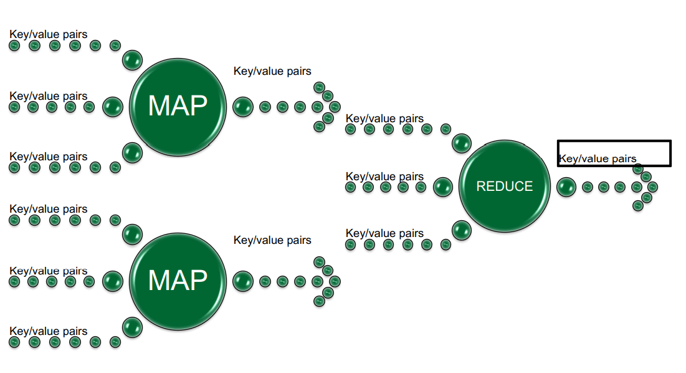
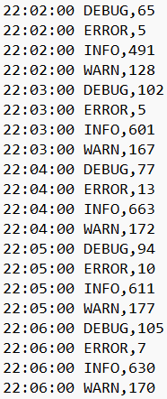
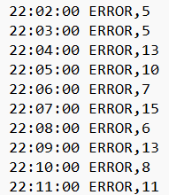
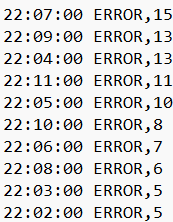
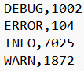
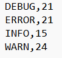

##  Log Processing using MapReduce 

 Name: Sahaja Peddaveerannagari

### Project Assignment 

The intention of the project is to create jobs for each task given below:  

1. Compute a CSV file that shows the distribution of different types of messages across predefined time intervals and injected string instances of the designated regex pattern for these log message types.  
2. Compute time intervals sorted in the descending order that contained most log messages of the type ERROR with injected regex pattern string instances.  
3. Compute the number of generated log messages for each message type.  
4. Compute the number of characters in each log message for each log message type that contain the highest number of characters in the detected instances of the designated regex pattern.  

### MapReduce Architecture

MapReduce is a programming framework that allows us to perform distributed and parallel processing on large data sets in a distributed environment. 

#### MapReduce consists of two distinct tasks — Map and Reduce.  

#### Mapper 
- Mapper is a function which process the input data. The mapper processes the data and creates several small chunks of data.  
- It accepts a key-value pair (key, value) and produces a multiset of key-value pairs, {(k_1,v_1),…,(k_p,v_p)}.

#### Reducer
- Reducer takes the output of the Mapper (intermediate key-value pair) process each of them to generate the output. The output of the reducer is the final output. 
- It accepts a pair (k, {value}), where a key is mapped to a multiset of some values, and it produces a map of key-set of values pair, with the same key(k,{v_1,…,v_s}) and a set of values that may be different from the ones in the input map. 

### Tasks
The goal of the assignment is to process the log file generated by the [LogFileGenerator](https://github.com/0x1DOCD00D/CS441_Fall2022/tree/main/LogFileGenerator).
#### 1. Job 1 : Create a file in comma separated format with distribution of message types in logs with messages of a particular pattern across predefined time interval.  

The start time and end time variables are defined to a particular time interval that are to be taken from application.conf file.
The Mapper will check whether the log messages are present in regex pattern defined and matches it against the particular time interval. Mapper sends the message 
type as Key and 1 as value to the Reducer.
The Reducer will add all 1s and gives the time interval against which the log message is present and the 
number of times it appeared.
- The first column represents the time intervals.
- The second column represents the log message types.
- The third column represents the number of times log events have appeared in the logs for that the particular message type with given pattern and between the time duration defined in configuration.

  

#### 2. Job 2 : Compute time intervals sorted in the descending order that contained most log messages of the type ERROR with injected regex pattern string instances.

In the first part, start time and end time variables are defined to a particular time interval that are to be taken from application.conf file.
The Mapper will check whether the log message 'ERROR' is present in regex pattern defined and matches it against the particular time interval. 
Mapper sends the message type as Key and 1 as value to the Reducer.
The Reducer will add all 1s and gives the time interval against which the log message 'ERROR' is present and the
number of times it appeared.
- The first column represents the time intervals.
- The second column represents the log message type 'ERROR'.
- The third column represents the number of times log events have appeared in the logs for 'ERROR' message type with the given pattern in that time duration.

#### Job2 (Final)

In the final part, the above output is taken as input.
The Key and the Value are swapped.

#### 3. Job 3 :Compute the number of generated log messages for each message type.

The Mapper matches the pattern defined in configuration with the log messages and 
sends the Message Type as Key and 1 as value to reducer.
The Reducer will add all 1s and gives the time interval against which the log message is present and the number of times it appeared.

- The first column represents the log message type.
- The second column represents the total number of generated log messages for each message type.

#### 4. Job 4 :Compute the number of characters in each log message for each log message type that contain the highest number of characters in the detected instances of the designated regex pattern.

The Mapper matches the pattern defined in configuration and designated regex pattern with the log messages and
sends the Message Type as Key and string length of the message as value to reducer.
The Reducer will get the maximum number of detected instances of the designated regex pattern in each log message for each log message type.
- The first column represents the log message type.
- The second column represents the maximum number of detected instances.

### Installations
- hadoop 3.3.4
- Scala 3.2.0
- jdk-11.0.16
- sbt-1.7.1
- Intellij IDEA 2022.2.2 (Ultimate)

### Building the Homework
To build the Homework:  
Clone this repository and import the project in IntelliJ IDEA

> git clone https://github.com/Sahajareddyp/CS441HW1.git

Open IntelliJ IDEA and navigate to File -> Open Folder -> CS441HW1  

To run tests, use the command  

> sbt clean compile test

To build, run
> sbt clean compile assembly

in the command line or

> clean compile assembly

sequentially in sbt shell

The above command will create a jar file in /target/scala-3.2.0/projectname.jar
### Running the Homework

To run the Homework:  

1. Go to cmd line, go to the hadoop directory, hadoop-3.3.4 and in that to sbin directory.  
2. Change the user from root to hdfs by running the command hdfs namenode -format.  
3. To start all the nodes, run the command- start-all.cmd which starts all the hadoop daemons all at once.
4. Copy the input file from regular directory to hdfs input directory:

> hdfs dfs -copyFromLocal input.txt  /input/input.txt

5. Run the jar file using below command.

> hadoop jar  ProjectName-assembly-0.1.jar /input/input.txt /output/

#### Output Files

- Output files can be accessed inside the path given as argument. For each job, a directory will be created.

### AWS Elastic MapReduce Execution  
#### Setup
- Sign In to Amazon Web Services.  
 
#### AWS EC2 (Elastic Compute Cloud).  
- Navigate to AWS EC2.  
- On EC2 dashboard, on the left Panel search for Key-Pair. 
- Create a Key-Pair

#### AWS S3 (Simple Storage Service)  
Navigate to AWS S3. Create an S3 bucket and upload the jar, log files in the S3 bucket created.

#### AWS EMR (Elastic MapReduce)  
1. Navigate to AWS EMR  and create an EMR cluster.
2. Enter a name and select the S3 bucket created above. Select the Key-Pair created earlier.

Wait till the cluster is ready and navigate to Steps tab under AWS EMR and add steps for individual jobs. Click on Add Step and 
select the jar from AWS S3 uploaded earlier.  
Provide the arguments as < s3BucketInput > < s3BucketOutput >

### Test Cases
Clone the Repository. In terminal, navigate to the repository and run the below command.

> sbt clean compile test

### YouTube Link

- YouTube link of the video that documents all steps of the deployment and execution :

### References

1. Dr. Grechanik, Mark, (2020) Cloud Computing: Theory and Practice.
2. [Apache Hadoop](https://hadoop.apache.org/)
3. [MapReduce](https://hadoop.apache.org/docs/r1.2.1/mapred_tutorial.html)
4. [StackOverflow](https://stackoverflow.com/)
5. [AWS EMR](https://aws.amazon.com/education/awseducate/)

